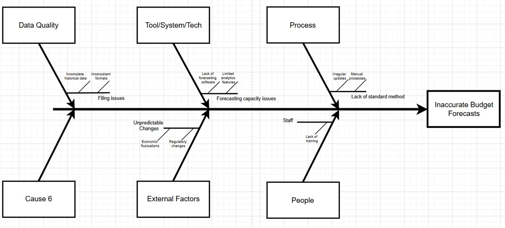
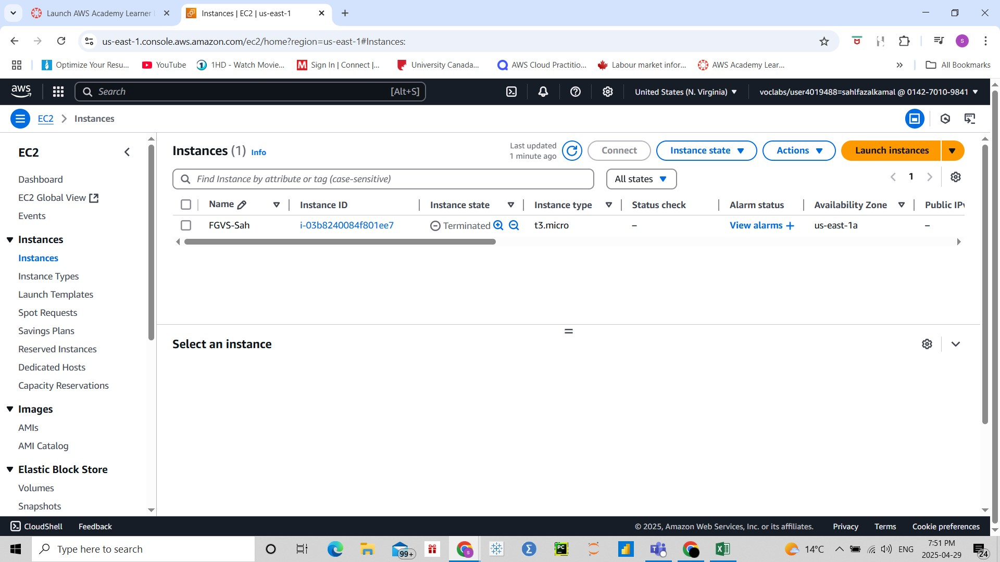
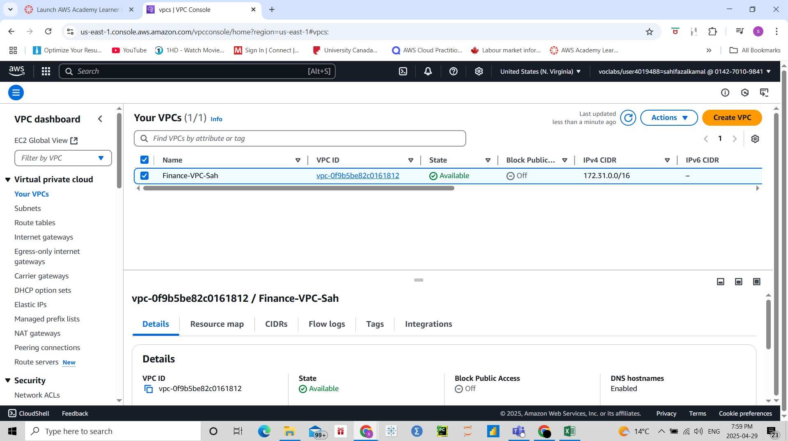

# AWS Projects

Welcome! This is a collection of my practical AWS projects and assignments. These projects focus on cloud computing, data storage, and AWS infrastructure. I've worked on services like **EC2**, **S3**, **EBS**, **IAM**, **Lambda**, and more.

I'm currently studying for an MBA in Business Analytics, and these projects show what I've learned by doing real cloud-based tasks.

---

# PROJECT 1 – Improving Budget Forecasting for the Finance Team Using AWS

## Project Description
In this project, I helped the Finance Department fix problems in their budget forecasting process. I used AWS (Amazon Web Services) to build a cloud-based system that makes their data easier to manage, more secure, and more accurate for future use.

---

## Objective
The goal was to study why the finance team's current forecasting was not working well, then create a cloud solution using AWS tools like **S3** and **EC2** to organize and protect their financial data.

---

## Dataset
I worked with different types of financial data and uploaded them into cloud storage:

- *Historical Budgets* – Past budget records  
- *Department Expenses* – Spending data by team  
- *Revenue Streams* – Income from different business activities  
- *Forecast Versions* – Different versions of budget estimates  
- *Operational Metrics* – Data that affects budget decisions  

---

## Methodology

### 1. Data Collection and Preparation
- Found out what was causing budget errors using a **Fishbone Diagram**  
- Planned how the data would be organized using Excel  
- Uploaded clean and well-labeled data to **AWS S3**

### 2. Descriptive Statistics
- Looked at trends in spending and budgets over time  
- Grouped data by department and time  
- Found differences between forecasted and actual spending  

### 3. Data Visualization

*Fishbone Diagram*  

### 4. Team Segmentation
- Identified how different finance teams use data  
- Created strategies for giving the right access to the right people  

### 5. Insights and Findings
- Old systems couldn’t grow with the company  
- Data was scattered and hard to work with  
- AWS helped bring all financial data into one place and lower storage costs  

### 6. Recommendations
- Keep using **AWS EC2** and **S3** for better data handling  
- Use **AWS Lambda** to automate updates and refreshes  

### 7. Implementation Screenshots

*EC2 Instance Setup*  

*S3 Bucket Structure*  

*Security Group Configuration*  

*VPC Architecture*  

---

## Tools and Technologies
- **AWS (Amazon Web Services)** – EC2, S3, VPC  
- **Microsoft Excel** – For planning and organizing the data lake  
- **Draw.io** – To create system diagrams  
- **Fishbone Diagram** – To find root causes of the forecasting issues  

---

## Deliverables
- A working cloud system on AWS for the Finance team  
- A planned and organized data lake in Excel  
- Diagrams showing system structure and data flow  
- Setup of AWS components like **VPC**, **EC2**, and **S3**  
- A final report with insights and recommendations  
- A presentation for the stakeholders  

---

## Summary
This project helped the Finance team move from outdated systems to a secure and modern cloud setup. With AWS, they can now store and use their financial data more efficiently, make better budget forecasts, and reduce the time spent managing files. This setup is ready for future improvements like automation and live dashboards.
